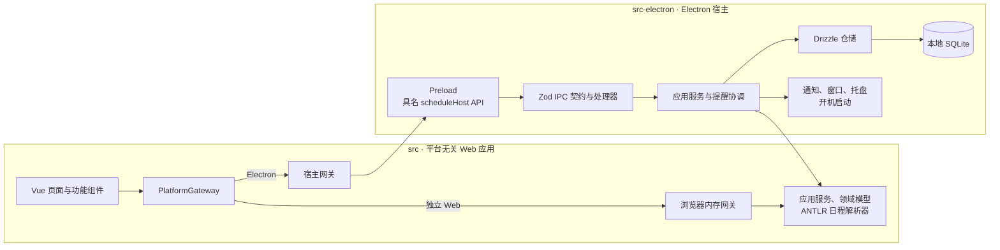

# Schedule v2

[English](README.en.md)

Schedule 是一个本地优先的日程应用：独立 Web 使用 `createInMemoryGateway`，日程、记录和设置会在刷新后重置；Electron 提供带有本地 SQLite 和设置持久化的桌面能力。当前不提供账户、登录或跨设备同步。

## 已实现能力

- 创建、编辑、收藏、删除和恢复 Event、Todo；ANTLR 日程表达式支持重复规则和排除规则。
- 管理具体时间片：单次排除、备注和 Todo 完成状态。
- Month、Week、Todo、详情、Database、Settings 和专注页面；Database 通过分页查询展示数据。
- 完整专注循环及专注记录、提醒计算。
- Electron 的 SQLite 和设置持久化、系统通知、托盘后台驻留和开机启动。

应用内 **Help** 页面提供日程表达式示例；实现边界见[架构文档](docs/architecture.md)。

## 架构



`src` 不依赖 Electron、Node 或数据库驱动；Electron 通过经过 Zod 校验的具名 IPC 契约接入平台无关核心。独立 Web 使用内存网关，Electron 使用 SQLite 持久化。更完整的边界与生命周期说明见[架构文档](docs/architecture.md)。

## 默认快捷键

可在“设置 → 键盘快捷键”中修改、清除或恢复这些快捷键。修改会保存在当前设备并在应用重启后恢复。

| 快捷键 | 行为 |
| --- | --- |
| `Ctrl+ArrowUp` | 打开新增日程对话框 |
| `Ctrl+ArrowDown` | 关闭新增日程对话框 |
| `Ctrl+ArrowLeft` / `Ctrl+ArrowRight` | 切换导航页面 |
| `Ctrl+1` … `Ctrl+7` | 向当前聚焦的 `rTime` 或 `exTime` 插入下一个周一至周日的日期 |
| `Ctrl+Enter` | 提交已打开的新增日程对话框 |

## 环境与安装

需要 Node.js 24 LTS，以及由 `package.json#packageManager` 固定的 pnpm 11.17.0。

```powershell
corepack enable
pnpm install --frozen-lockfile
```

## 常用命令

| 命令 | 用途 |
| --- | --- |
| `pnpm dev:web` | 启动 Web 开发服务器 |
| `pnpm build:web` | 类型检查并构建 Web 产物 |
| `pnpm build:electron` | 类型检查并构建 Electron main 与 preload 产物 |
| `pnpm start:electron` | 构建并启动 Electron |
| `pnpm lint` | 运行 ESLint |
| `pnpm typecheck` | 检查 Web 与 Electron TypeScript |
| `pnpm test:unit` | 运行单元、契约和 parser 测试 |
| `pnpm test:integration` | 重建原生模块后运行集成测试 |
| `pnpm test:e2e:web` | 构建并运行 Web E2E |
| `pnpm test:e2e:electron` | 重建原生模块、构建并运行 Electron E2E |
| `pnpm parser:generate` | 从语法文件重新生成 parser |
| `pnpm parser:check-generated` | 生成 parser 并检查已提交生成物是否一致 |
| `pnpm package:win` | 打包 Windows x64 NSIS 安装程序 |
| `pnpm test:package:win` | 对打包应用运行冒烟测试 |
| `pnpm release:win` | 运行完整 Windows 发布验证链路 |

Electron 与打包 E2E 会启动 GUI 子进程，应在 Windows 桌面会话中运行。Windows 本地发布细节见[Windows 发布说明](docs/development/windows-release.md)。

## 数据库行为

Electron 在目标数据库不存在时，执行 `src-electron/adapters/db/schema.sql` 创建一份全新的 v2 SQLite 数据库；已有数据库只会打开，不执行转换或升级。不存在 1.2 数据导入、转换、备份或迁移流程，旧数据兼容不是 v2 目标。

## 当前范围

- 同步、账户与认证暂缓。
- Tauri 宿主暂缓；`src` 保持可在浏览器运行，为未来适配保留平台契约。
- 当前仅验证 Windows x64 NSIS 打包；未实现签名、自动更新、macOS 或 Linux 打包。
